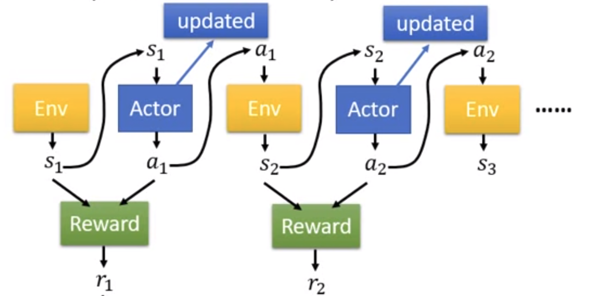

# Problem Set Up

The basic component of a RL set up will be _Actor_ \(player/model\), _Environment_ \(game/real environment/other agent\), _reward function_ \(pseudo rule/score\).

To formalize a RL problem, we can use Markove Decision Process, defined by: $$(\mathcal{S}, \mathcal{A}, \mathcal{R}, \mathbb{P}, \gamma)$$, where

* $$\mathcal{S}$$ : set of possible states
* $$\mathcal{A}$$ : set of possible actions
* $$\mathcal{R}$$ : distribution of reward given \(state, action\) pair
* $$\gamma$$ : discount factor

A trajectory (1 full run of a game) is $$ \tau=\left\{s_{1}, a_{1}, s_{2}, a_{2}, \cdots, s_{T}, a_{T}\right\} $$

Let's assume actor is a network with parameter $$\theta$$, we can then calculate the probability of a trajectory happen in the game as:

$$
\begin{array}{l}{p_{\theta}(\tau)} \\ {\quad=p\left(s_{1}\right) p_{\theta}\left(a_{1} | s_{1}\right) p\left(s_{2} | s_{1}, a_{1}\right) p_{\theta}\left(a_{2} | s_{2}\right) p\left(s_{3} | s_{2}, a_{2}\right) \cdots} \\ {=p\left(s_{1}\right) \prod_{t=1}^{T} p_{\theta}\left(a_{t} | s_{t}\right) p\left(s_{t+1} | s_{t}, a_{t}\right)}\end{array}
$$
So the trajectory depends on both the actor $$p_{\theta}\left(a_{t} | s_{t}\right)$$ and Env $$p\left(s_{t+1} | s_{t}, a_{t}\right)$$

## How good is a state?

**Value Function** at state s, is the expected cumulative reward from following the policy from state s:

$$
V^{\pi}(s)=\mathbb{E}\left[\sum_{t \geq 0} \gamma^{t} r_{t} | s_{0}=s \right]
$$

Note that there exists an **optimal value function** that has the highest value for all states (depend on **policy**).

$$
V^{*}(s)=\max _{\pi} V^{\pi}(s) \quad \forall s \in \mathbb{S}
$$

## How good is a state-action pair?

**Q-value function** at state s and action a, is the expected cumulative reward from taking action a in state s and then following the policy:

$$
Q^{\pi}(s, a)=\mathbb{E}\left[\sum_{t \geq 0} \gamma^{t} r_{t} | s_{0}=s, a_{0}=a \right]
$$

Similarly, there exists an **optimal q function** $$
Q^{*}(s, a)=\max _{\pi} \mathbb{E}\left[\sum_{t \geq 0} \gamma^{t} r_{t} | s_{0}=s, a_{0}=a \right]
$$

There is a relationship between the two optimal functions V∗ and Q∗. It is given by:
$$
V^{*}(s)=\max _{a} Q^{*}(s, a) \quad \forall s \in \mathbb{S}
$$

Actually, once we have the optimal Q-function, it is a done deal, we get the optimal policy.

